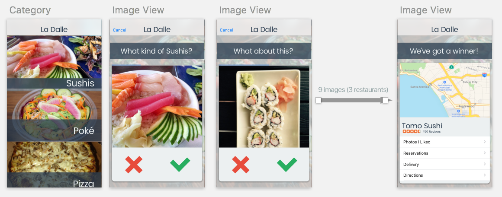

# La Dalle

La Dalle is an iOS app that uses the new Yelp Fusion API. It is written in Swift 3.

> Avoir / crever *la dalle* - to be starving

## Idea

Finding where to eat is hard. Restaurant reviews are not always objective and you sometimes miss your next favorite spot because a person had a bad day and wrote a negative review. Customer generated photos don't lie. La Dalle helps you find a place that you will like based on images of places around you, not reviews.

## Prototype

I started designing the UI from my head directly to Sketch:

## Features

### Places around you

When the app loads, it gathers places that are less than 10 minutes walking from you.
If you move more than 200 meters, it will reload with new places. You can always pull-to-refresh to update the list based on your current location.

### Businesses List
When you select a category, the app will loads places that matches the selected category. Each place are displayed as cards that contains the business name and main photo.

### Place search gamified

*- Coming soon*

### Business details
The business detail view shows a card that contains a Map view. This map is centered on the business location, and is wide enough to show your current location as well. You can get the place's address by tapping on the pin.

A business is described by it's name, rating from Yelp users, and a number of reviews. A table view lists the first 3 reviews for this specific cell.

An action button on the top right of the app allows you to share the place with your friends on twitter, iMessage or other social networks. The message is predefined, and is accompanied by an image from the place, and a link to the business on Yelp.

## Improvements

* Load the first image of the first business from the category as a category photo
* Add a filter on category search to limit to opened places, or increasing search radius...
* Implement the business search gamification.
* Allows a user to define his own location (example when preparing a trip to a remote place, look at the dishes that will be around you at that time.)
